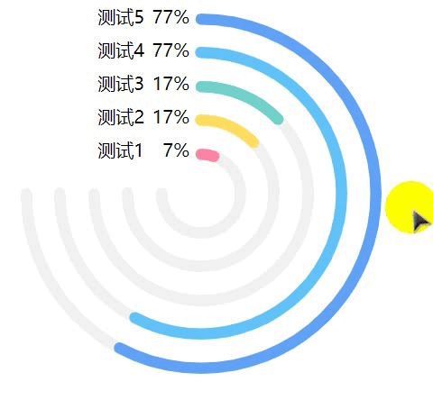

## vue多圆环进度条/百分比
这个项目在原项目上，修改部分，实现多个圆环并且显示标题以及百分比。

# 示例运行步骤
- 【下载依赖】npm install
- 【运行项目】npm run dev
- 【打开对应链接】浏览器打开对应链接

# 源代码
- /src/App.vue是使用圆形进度条组件的代码实例
- 组件源代码为circle-progress.vue，circleCollection.vue拷贝文件，直接使用即可
-其中circle-progress.vue为[这个项目](https://github.com/Momo707577045/vue-circle-progress)的源码，稍做了修改
# 使用方法如下
- 各个参数名称以及使用方法可以查看App.vue以及circleCollection.vue中的注释。
- 参数
` // 如果多个同时存在，应向子组件传不同
  options: {
        ringSpacing: 30, // 环间距
        ringNum: 5, //环的个数
        width: 320,
        // 最大环宽度  直径
        radius: 10,
        //  环宽
        progressPro: [7, 17, 17, 77, 77],
        // 各个环百分比
        barColors: ["#FF82A2", "#FEDD5E", "#70D2C9", "#5FC2FA", "#5FA1F7"],
        // 各个颜色
        duration: 1000,
        // 动画时长
        titles: ["测试1", "测试2", "测试3", "测试4", "测试5"],
        backgroundColor: "#F1F1F1",
        // 动画类型
        timeFunction: "cubic-bezier(0.99, 0.01, 0.22, 0.94)",
        // 是否动画效果
        // isAnimation:false,
        // 是否圆形描边
        // isRound:false
      }`
- 使用
` <Circle-collection :option="options" id='Circle'></Circle-collection>`
- 组件原理及详细介绍，可以去原项目查看。